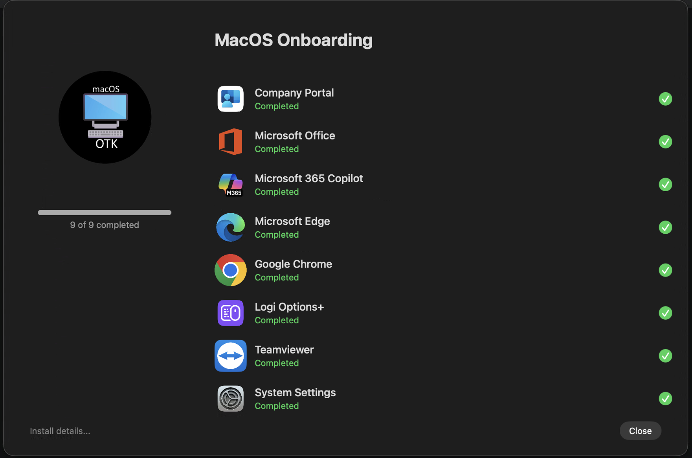
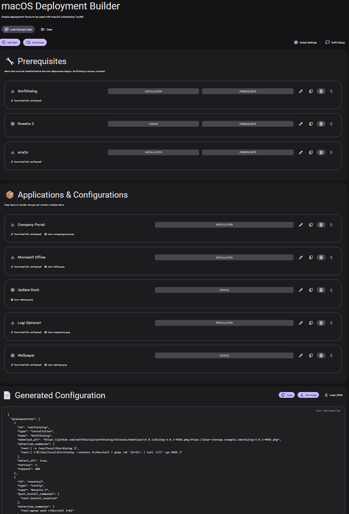
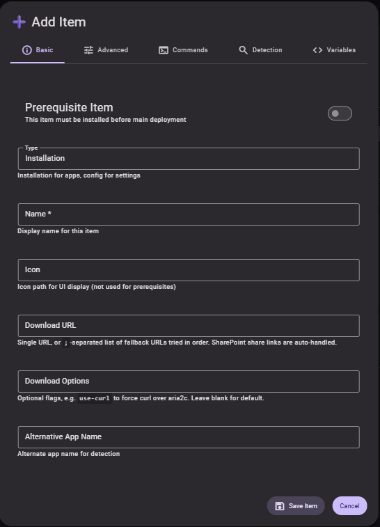
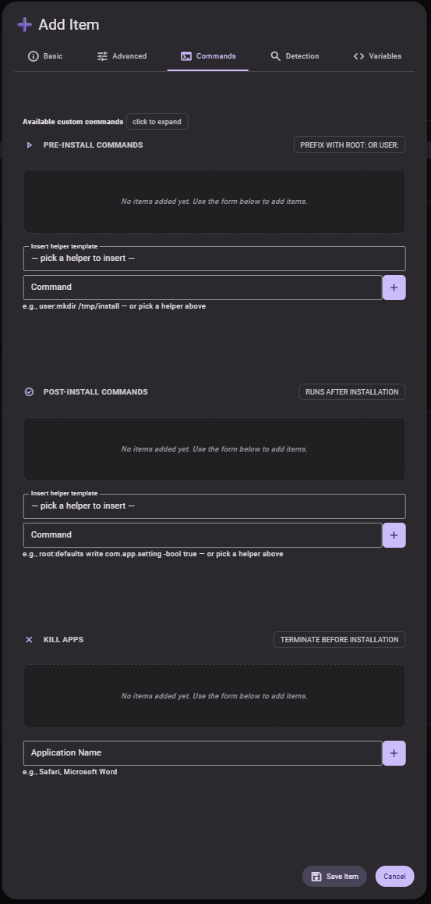
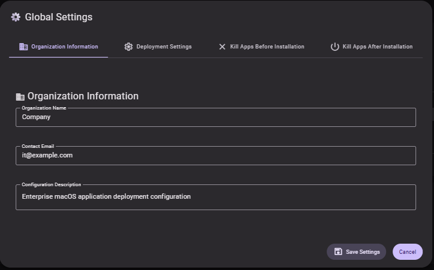
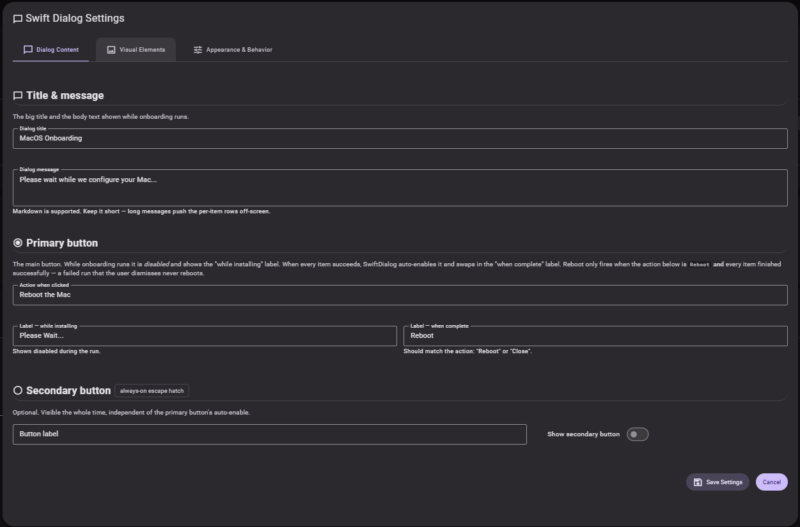

# macOS Onboarding Toolkit (OTK)

> A config-driven toolkit for **automating macOS onboarding** - rich progress UI via Swiftdialog's inspect mode and designed to deploy via **Microsoft Intune**.



---

## TL;DR

**One JSON file describes your entire Mac onboarding - apps, system config, and the progress UI the user watches. Two shell scripts do the rest. No MDM policies to sequence, no per-app installer scripts to write.**

- **Declarative:** everything lives in `apps.json` - prerequisites, apps, groups, detection rules, pre/post commands. Edit it with the bundled [visual builder](#the-json-builder) (a single HTML file, no install).
- **Self-contained engine:** downloads and installs PKG/DMG/ZIP/TAR/7z itself - including awkward payloads like installers nested inside archives - with multi-URL fallback, retries, and [aria2c acceleration](#bundled-aria2c-build-for-apple-silicon).
- **Idempotent:** layered per-item [detection](#detection-logic--defaults) means re-runs only install what's missing or new - which is also how config updates roll out to an existing fleet, silently.
- **Live progress UI** via [SwiftDialog](https://github.com/swiftDialog/swiftDialog) inspect mode, driven by real verified state.
- **Secure by option:** [sign your config](#config-signing) and devices refuse to execute anything you didn't sign.

**Get started:** host three files on any HTTPS storage, point the installer script at them, deploy via Intune - the whole path is [9 numbered steps](#the-short-version---first-deployment-in-9-steps).

---

## Table of contents

- [macOS Onboarding Toolkit (OTK)](#macos-onboarding-toolkit-otk)
  - [TL;DR](#tldr)
  - [Table of contents](#table-of-contents)
  - [Features](#features)
  - [What makes OTK different?](#what-makes-otk-different)
    - [A self-contained install engine](#a-self-contained-install-engine)
    - [A layered detection engine](#a-layered-detection-engine)
    - [A visual config builder](#a-visual-config-builder)
  - [Quick start](#quick-start)
    - [The short version - first deployment in 9 steps](#the-short-version---first-deployment-in-9-steps)
    - [Prepare your hosting](#prepare-your-hosting)
    - [Pick an installer](#pick-an-installer)
    - [Option A - Microsoft Intune (recommended)](#option-a---microsoft-intune-recommended)
    - [Option B - Manual install on a Mac](#option-b---manual-install-on-a-mac)
    - [Where things land on disk](#where-things-land-on-disk)
  - [The script side](#the-script-side)
    - [`otk-install.sh` - installer \& updater](#otk-installsh---installer--updater)
    - [`otk-intune-onboarding.sh` - slim Intune entry point](#otk-intune-onboardingsh---slim-intune-entry-point)
      - [The PPPC gate (configure or disable before deploying)](#the-pppc-gate-configure-or-disable-before-deploying)
    - [`onboardingProcess.sh` - orchestrator](#onboardingprocesssh---orchestrator)
    - [`apps.json` - declarative config](#appsjson---declarative-config)
      - [Minimal example](#minimal-example)
    - [Detection logic \& defaults](#detection-logic--defaults)
    - [Multi-URL downloads \& retries](#multi-url-downloads--retries)
    - [Bundled aria2c build for Apple Silicon](#bundled-aria2c-build-for-apple-silicon)
    - [Built-in custom commands](#built-in-custom-commands)
    - [Versioning \& auto-updates](#versioning--auto-updates)
  - [The JSON Builder](#the-json-builder)
    - [Tour of the canvas](#tour-of-the-canvas)
    - [Editing an item - the 5-tab modal](#editing-an-item---the-5-tab-modal)
    - [Global Settings](#global-settings)
    - [SwiftDialog Settings](#swiftdialog-settings)
    - [Export \& import](#export--import)
  - [Internals](#internals)
    - [Validation](#validation)
    - [Download Manager](#download-manager)
    - [Unified Installation Engine](#unified-installation-engine)
    - [Desktop \& Enrollment Guards](#desktop--enrollment-guards)
    - [SwiftDialog integration](#swiftdialog-integration)
  - [Logs \& troubleshooting](#logs--troubleshooting)
  - [Uninstall](#uninstall)
  - [Config signing](#config-signing)
    - [Setup (once)](#setup-once)
    - [On every config update](#on-every-config-update)
    - [Signing from Windows](#signing-from-windows)
    - [How verification behaves on-device](#how-verification-behaves-on-device)
  - [Security notes](#security-notes)
  - [Acknowledgements](#acknowledgements)
  - [License](#license)


## Features

- **Config-driven installs** using a single `apps.json` (prereqs, apps, configs, and groups).
- **Detection-first.** runs via `detection_commands` skip already-compliant items.
- **Robust downloads.** Multiple URLs per item, retry/backoff, `aria2c` → `curl` fallback - including a [precompiled aria2c pkg for Apple Silicon](#bundled-aria2c-build-for-apple-silicon) since no official binary exists.
- **Pre/Post actions.** Kill conflicting apps; run `root:` or `user:` commands before and after install.
- **UI or headless.** Rich SwiftDialog progress UI in Inspect Mode, or `--silent` for unattended updates.
- **Dry-run mode.** Probe URLs and execute detection without making any system changes.
- **Versioning & auto-updates.** Reads `global_settings.version`, stores deployed version, and (optionally) installs a LaunchDaemon that re-applies onboarding silently when the config changes.
- **Signed config.** Optional but recommended: RSA-signed `apps.json`/toolkit downloads, verified on-device before anything runs as root - see [Config signing](#config-signing).
- **Visual builder.** A single-file HTML app (`json-builder/macos-deployment-builder.html`) edits, validates, and exports `apps.json` end-to-end.
- **Structured logging & state.** Logs and per-item state plists under `/Library/Application Support/Microsoft/IntuneScripts/`.

---

## What makes OTK different?

The Mac admin community has several excellent SwiftDialog-based onboarding tools, and most share the same shape: a script drives the progress UI while the actual installs are delegated elsewhere - to MDM-required apps, policies, or a separate installer tool - and "detection" means waiting for an `.app` bundle to appear. OTK was built because I needed more than that in three specific areas:

### A self-contained install engine

OTK doesn't delegate installs - it downloads and installs everything itself. Each item gets multi-URL fallback (`;`-separated, vendor link first, internal mirror second), retry with backoff, accelerated downloads via aria2c, and handlers for PKG, DMG, ZIP, TAR, and 7z - including nested payloads (a pkg inside a dmg inside a zip) and files served with misleading extensions (`detect_package_type` sniffs the real format).

The case that forced this: **Logi Options+**. Logitech ships a zip containing neither an app nor a pkg but a *raw installer executable* that must be run with vendor-specific silent flags. OTK extracts the archive, hunts for a payload in priority order (PKG → DMG → `.app` → executable), pinpoints the right file via `installer_name`, and exports it as `$INSTALLER_PATH` for your post-install commands:

```jsonc
{
  "type": "installation",
  "name": "Logi Options+",
  "alt_app_name": "logioptionsplus.app",
  "download_url": "https://download01.logi.com/web/ftp/pub/techsupport/optionsplus/logioptionsplus_installer.zip",
  "installer_name": "logioptionsplus_installer",
  "post_install_commands": [
    "root:$INSTALLER_PATH --quiet --analytics No --flow No --sso No"
  ]
}
```

The same machinery covers licensed installers that need tokens on the command line (via `custom_variables`) and any vendor executable with arbitrary switches - uniformly for every item, described in JSON rather than per-app script code.

### A layered detection engine

Whether an item runs at all is decided by real detection, not just an app-bundle check: explicit `detection_commands` running as root or the console user, combinable with AND/OR logic (`detect_all`), then per-item state plists, then the `/Applications/<name>.app` fallback. That makes runs fully idempotent - re-running onboarding (or letting the update daemon force a pass after a config bump) skips everything already compliant, and works just as well for non-app items like wallpapers, default-handler settings, and device renaming as it does for installs. The same state plists drive the SwiftDialog rows, so the UI reflects actual verified state rather than "the script got this far."

### A visual config builder

The entire deployment is one `apps.json` - no variables to edit inside scripts. And you don't have to hand-write it: the bundled [JSON Builder](#the-json-builder) is a single-file HTML app (open it in a browser, no install) with drag-and-drop ordering, groups, helper-template dropdowns for the built-in commands, validation, and clean round-tripping of existing configs.

---

## Quick start

### The short version - first deployment in 9 steps

Everything below is explained in depth later; this is the minimum path from zero to an onboarded test Mac via Intune.

1. **Get the toolkit** - clone or download this repo.
2. **Build your config** - open `json-builder/macos-deployment-builder.html` in a browser, click **Load Example Data** (or **Load** and paste [`apps.example.json`](apps.example.json)), edit your apps, then **Download** as `apps.json`.
3. **Zip the runtime** - from the repo root: `zip -r onboardingtoolkit.zip onboardingProcess.sh functions/` (the two must sit at the zip root, no wrapping folder).
4. **Zip your icons** - every PNG your config references, in one **flat** `icons.zip`.
5. **Upload all three** (`apps.json`, `onboardingtoolkit.zip`, `icons.zip`) to any HTTPS host your Macs can reach (Azure Blob, S3, a web server) and note the three URLs.
6. **Point the installer at them** - edit the three `ONBOARDING_*_URL` values at the top of `otk-intune-onboarding.sh`. → [details](#prepare-your-hosting)
7. **Sign your config** *(recommended - one command)* - `./otk-sign.sh --init` creates keys and wires the public key into the installer automatically; then `./otk-sign.sh` and upload the two `.sig` files next to the artifacts. (Skipping this works too - devices just log a warning.) → [details](#config-signing)
8. **Handle PPPC** - if your onboarding uses AppleScript steps (wallpaper, default browser), deploy a PPPC profile ([`pppc-example.mobileconfig`](pppc-example.mobileconfig) is ready to adapt) and set its name in the script; otherwise empty the two PPPC constants to skip the gate. → [details](#the-pppc-gate-configure-or-disable-before-deploying)
9. **Deploy via Intune** - upload `otk-intune-onboarding.sh` as a macOS shell script (run as root, no arguments), assign it with a **run frequency** (e.g. daily), and enroll a test Mac. Watch progress in the SwiftDialog UI or in `/Library/Application Support/Microsoft/IntuneScripts/logs/`.

Config updates later are even shorter: edit `apps.json` → bump `global_settings.version` → re-sign → upload. The fleet picks it up on the next scheduled run. → [details](#versioning--auto-updates)

### Prepare your hosting

Before any Mac can run the toolkit, three artifacts need to live at HTTPS URLs the target Mac can reach. Any static-file host works - Azure Blob Storage, S3, an internal CDN, even a private GitHub release.

**1. Bundle the runtime** - zip `onboardingProcess.sh` together with the `functions/` folder so the layout inside the archive is:

```
onboardingtoolkit.zip
├── onboardingProcess.sh
└── functions/
    ├── custom-commands.sh
    ├── logging-configuration.sh
    ├── state-managment.sh
    ├── swift-dialog.sh
    ├── unified_installer.sh
    └── utility-functions.sh
```

The installer extracts this directly into `/Library/Application Support/Microsoft/IntuneScripts/onBoarding/`, so the root of the zip must contain `onboardingProcess.sh` (not a wrapping folder).

**2. Bundle your icons** - collect every PNG referenced by `apps.json` (the `icon` field on items, prerequisites, and `swift_dialog_settings`) into a **flat** zip:

At install time the contents land in `Swift Dialog/icons/` and SwiftDialog references them by filename. Icons are non-critical - a missing `icons.zip` will only warn, not fail the run.

**3. Author your `apps.json`** - fastest path is to open `json-builder/macos-deployment-builder.html` in a browser, click **Load Example Data**, edit, then **Download**. The exported file is the exact shape the orchestrator consumes. Alternatively, start from [`apps.example.json`](apps.example.json) in this repo - a validated, fully-commented-by-structure example showing prerequisites, multi-URL fallbacks, detection, `custom_variables`, groups, and the built-in custom commands (replace every `YOUR_HOST` placeholder).

**4. Upload all three to the same host.** They don't have to share a folder, but the URLs need to be reachable over HTTPS from the Mac during onboarding.

**5. Point the installer at your URLs.** Edit the `DEPLOYMENT CONFIG - REPLACE BEFORE FORKING` banner near the top of `otk-install.sh` **and** `otk-intune-onboarding.sh`:

```bash
readonly ONBOARDING_SCRIPTS_URL="https://<YOUR_HOST>/onboardingtoolkit.zip"
readonly ONBOARDING_APPS_URL="https://<YOUR_HOST>/apps.json"
readonly ONBOARDING_APPS_ICONS_URL="https://<YOUR_HOST>/icons.zip"
```

`apps.json` is re-fetched by the LaunchDaemon's version check (when `otk-install.sh` is used), so updating just that file at the hosted URL - without changing the installer - is the supported way to push config updates to an installed fleet. Bump `global_settings.version` in the new `apps.json` so the daemon detects the change.

**6. (Strongly recommended) Sign your artifacts.** `apps.json` and `onboardingtoolkit.zip` are executed as root on every Mac in your fleet - signing them means a compromised storage account can't push malicious config to your devices. One command to set up, one command per update - see **[Config signing](#config-signing)**.

### Pick an installer

The toolkit ships two entry points. Both bootstrap onboarding from the same blob storage, but they differ in lifecycle:

| Script | LaunchDaemon | Auto-updates via apps.json `version` | Best for |
| --- | :-: | :-: | --- |
| **`otk-install.sh`** | ✅ creates one | ✅ daemon polls, re-downloads, and re-runs onboarding | Long-lived fleets where you want config bumps to roll out automatically without MDM involvement |
| **`otk-intune-onboarding.sh`** | ❌ no daemon | ✅ Intune-driven: each scheduled run probes the hosted version and silently updates onboarded machines only when it's newer | Intune-managed fleets - assign with a run frequency and Intune becomes the update scheduler |


### Option A - Microsoft Intune (recommended)

Upload either script as an Intune Shell Script and deploy **without arguments**. `otk-install.sh` defaults to `--install`, downloads resources, validates, runs the initial onboarding, and registers a daemon for ongoing version checks. `otk-intune-onboarding.sh` does the same one-shot work but skips the daemon - pair it with Intune redeploys when `apps.json` changes.

### Option B - Manual install on a Mac

```bash
# 1) Run the installer (defaults to --install when no args are supplied)
sudo ./otk-install.sh

# 2) Or be explicit
sudo ./otk-install.sh --install

# 3) Re-run onboarding later (also clears the completion flag)
sudo ./otk-install.sh --run

# 4) Show current status
sudo ./otk-install.sh --status
```

> Make sure you've replaced the URLs in the `DEPLOYMENT CONFIG` banner first - see **[Prepare your hosting](#prepare-your-hosting)** above.

### Where things land on disk

```
/Library/Application Support/Microsoft/IntuneScripts/
  ├── onBoarding/
  │   ├── onboardingProcess.sh
  │   ├── apps.json
  │   ├── functions/           # helper functions (sourced by onboardingProcess.sh)
  │   └── onboarding.flag      # written on successful completion; presence
  │                            # short-circuits re-runs (unless --force)
  ├── Swift Dialog/
  │   └── icons/               # app icons for the dialog
  ├── logs/
  │   ├── onboarding.log
  │   ├── deployment.log
  │   └── daemon.log / daemon-error.log   # only if the LaunchDaemon is installed
  └── state/
      ├── apps.version         # stored configuration version
      └── <id>.plist           # per-item state (drives SwiftDialog row icons)
```
---

## The script side

### `otk-install.sh` - installer & updater

```bash
# Install / update toolkit (DEFAULT when no args are provided)
sudo ./otk-install.sh --install

# Show status
sudo ./otk-install.sh --status

# Run the onboarding process now (honors --dry-run)
sudo ./otk-install.sh --run [--dry-run]

# Validate installation
sudo ./otk-install.sh --validate

# Force download latest resources and optionally run onboarding
sudo ./otk-install.sh --force-update

# Create or remove the LaunchDaemon for periodic version checks
sudo ./otk-install.sh --create-launchd
sudo ./otk-install.sh --remove-launchd

# Check for updates without installing
sudo ./otk-install.sh --check-version

# Uninstall (prompts to keep or remove config/logs/state)
sudo ./otk-install.sh --uninstall

# Verbose debug logging (composable with other commands)
sudo ./otk-install.sh --debug --install
```

### `otk-intune-onboarding.sh` - slim Intune entry point

A variant of `otk-install.sh` with the same bootstrap logic but **no LaunchDaemon** and a slim CLI - Intune owns the lifecycle instead.

```bash
sudo ./otk-intune-onboarding.sh           # see behavior below - no args needed
sudo ./otk-intune-onboarding.sh --debug   # verbose
```

Behavior depends on the machine's state, so one Intune script assignment covers the whole fleet:

- **Fresh machine** - downloads the toolkit (signature-verified), installs it, runs onboarding once with the full SwiftDialog UI.
- **Already onboarded** (completion flag present) - acts as a version-aware updater: probes the hosted `apps.json` (also signature-verified) and, **only if `global_settings.version` is strictly newer** than the installed version, re-downloads everything and re-runs the orchestrator with `--force --silent` - no UI, no reboot, and per-item detection means only new or changed items actually install. If the version isn't newer, it exits without touching anything.
- **Interrupted update** - if a silent update dies mid-run (the completion flag is cleared during a forced run), the next cycle detects the machine has onboarded before and resumes silently instead of re-showing the onboarding UI.

Assign the script in Intune **with a run frequency** (e.g. daily or weekly) and the fleet converges on every config version bump - the same rollout model as `otk-install.sh`'s LaunchDaemon, but with Intune as the scheduler.

Prefer the classic **run-once-and-never-again** behavior? Set `ENABLE_FLEET_UPDATES="false"` near the top of the script (Intune deploys without arguments, so the variable is the switch there; `--run-once` does the same for manual invocations). Onboarded machines are then never touched again and config updates reach new machines only.

#### The PPPC gate (configure or disable before deploying)

Intune sometimes runs shell scripts *before* all device-targeted configuration profiles have landed. If onboarding starts in that window, AppleScript-driven steps (setting the wallpaper, auto-clicking the default-browser confirmation) hit unprovisioned TCC and hang on invisible consent dialogs or silently fail. To avoid this, `otk-intune-onboarding.sh` waits (default 10 minutes, override with the `PPPC_WAIT_TIMEOUT` env var) for your org's **PPPC (Privacy Preferences Policy Control) profile** to be present before doing anything, and exits non-zero on timeout so Intune retries later.

Two constants near the top of the script control the match - **both ship with placeholder values you must replace**:

```bash
readonly PPPC_PROFILE_NAME_MATCH="PPPC Deploy"     # substring of your profile's display name
readonly PPPC_PROFILE_IDENTIFIERS=( "..." )        # and/or explicit payload identifier(s)
```

The check passes when *either* matches (name matching survives Intune's UUID rotation on profile edits). **No PPPC profile in your org?** Empty both (`""` and `()`) and the gate is skipped with a logged warning - just know that user-context AppleScript steps may then need TCC consent by other means.

`otk-install.sh` carries the same two constants for the same reason - **they default to empty (gate skipped)** there, which is right for manual and daemon deployments. If you deploy `otk-install.sh` through Intune instead of the slim script, configure them the same way.

**Don't have a PPPC profile yet?** Start from [`pppc-example.mobileconfig`](pppc-example.mobileconfig) in this repo - it pre-approves exactly the TCC permissions OTK's AppleScript steps need (Accessibility + AppleEvents for the Intune MDM agent, `/bin/bash`, `osascript`, System Events, and Terminal for debug runs, toward Finder / System Events / System Settings / SystemUIServer). The header comment walks through the four steps: generate fresh UUIDs, set your org naming, upload as a **Custom** template profile in Intune assigned to the same device group as the script, and point `PPPC_PROFILE_NAME_MATCH` / `PPPC_PROFILE_IDENTIFIERS` at it.

### `onboardingProcess.sh` - orchestrator

```bash
# Standard run (with SwiftDialog UI)
sudo /Library/Application\ Support/Microsoft/IntuneScripts/onBoarding/onboardingProcess.sh

# Force re-run even if onboarding.flag exists
sudo /Library/.../onboardingProcess.sh --force

# Headless mode (no UI)
sudo /Library/.../onboardingProcess.sh --silent

# Dry run (probe URLs & run detection only; no system changes)
sudo /Library/.../onboardingProcess.sh --dry-run

# Debug logging
sudo /Library/.../onboardingProcess.sh --debug

# Help
sudo /Library/.../onboardingProcess.sh --help
```

> **Reboot prompt:** On successful completion in interactive mode, the SwiftDialog primary button triggers a reboot via `loginwindow`. `--silent` and `--dry-run` skip this.

### `apps.json` - declarative config

Top-level sections:

- **`metadata`** - descriptive fields (`version`, `created`, `organization`, `contact`).
- **`global_settings`** - toolkit defaults: `version`, `default_retries`, `default_dl_timeout`, `kill_apps_pre`, `kill_apps_post`.
- **`swift_dialog_settings`** - dialog look & feel: `title`, `message`, `iconsize`, `bannerimage`, etc.
- **`prerequisites`** - items installed first, with no UI/state tracking (jq, aria2c, SwiftDialog, utiluti, Rosetta…).
- **`items`** - array of items with `type: installation | config | group`. Groups can nest `apps`.

Each item commonly supports:

- `id` (required - used as the SwiftDialog row identifier and as the per-item state filename `state/<id>.plist`), `type`, `name`, optional `subtitle`, `icon`
- **Installers:** `download_url` (single, or `;`-separated list of fallback URLs tried in order), `download_options` (e.g. `use-curl` to force curl over aria2c), optional `download_path`, `installer_name`, `app_path` for `.app` inside DMG/archive, `archive_password` for password-protected zip/7z/rar payloads (builder: Advanced tab; ignored with a logged warning for PKG/DMG/tar payloads; note `apps.json` is world-readable on the device, so use it for AV-evasion wrappers, not real secrets)
- **Behavior:** `retries`, `timeout`, `detect_all` (`true` = AND, `false`/missing = OR for multi-line detection), `kill_apps`, `alt_app_name`
- **Logic:** `detection_commands` (string or array; lines prefixed with `root:` or `user:`)
- **Post actions:** `pre_install_commands`, `post_install_commands` (root or user context)
- **Variables:** `custom_variables` (key/value map; values can be strings or arrays - referenced in commands as `$KEY`)

#### Minimal example

```jsonc
{
  "metadata": {"version": "1.0", "organization": "Your Org"},
  "global_settings": {"default_retries": 2, "default_dl_timeout": 300},
  "swift_dialog_settings": {
    "title": "macOS Onboarding",
    "message": "Please wait while we configure your Mac..."
  },
  "items": [
    {
      "type": "installation",
      "name": "Microsoft Edge",
      "icon": "edge.png",
      "download_url": "https://go.microsoft.com/fwlink/?linkid=2093504",
      "retries": 3,
      "detection_commands": [
        "root:[ -d '/Applications/Microsoft Edge.app' ]"
      ],
      "kill_apps": ["Safari"],
      "post_install_commands": [
        "user:set_browser_default \"Microsoft Edge\""
      ]
    },
    {
      "type": "config",
      "name": "Set Wallpaper",
      "download_url": "https://your-host/corp-wallpaper.jpg",
      "download_path": "/Users/Shared/corp/wall.jpg",
      "detection_commands": [
        "root:[ -f /Users/Shared/corp/wall.jpg ]"
      ],
      "post_install_commands": [
        "user:osascript -e 'tell app \"Finder\" to set desktop picture to POSIX file \"/Users/Shared/corp/wall.jpg\"'"
      ]
    }
  ]
}
```

### Detection logic & defaults

The toolkit uses a layered strategy to decide whether an item is **already compliant** and can be skipped:

1. **Explicit detection commands (preferred).** If `detection_commands` is set, each line runs in the specified context (`root:` or `user:`). Combine checks with `&&` on a single line, or list multiple lines and choose:
   - `detect_all: true` → **AND** (all commands must succeed)
   - `detect_all: false` → **OR** (any command may succeed)
2. **State tracking.** When an item installs successfully, the engine writes a per-item plist under `state/<id>.plist` with `state=installed`. On subsequent runs, that plist is checked and the item is skipped.
3. **Application bundle fallback.** With no `detection_commands` and no state file, the engine checks `/Applications/<name>.app` (or `alt_app_name` if set, e.g. `TeamViewerHost.app`).

> **Tip.** Prefer explicit `detection_commands` for non-app configurations (defaults, profiles, handlers, wallpapers) so detection stays reliable.

```jsonc
{
  "type": "installation",
  "name": "Microsoft 365 Apps",
  "detection_commands": [
    "root:[ -d '/Applications/Microsoft Word.app' ] && [ -d '/Applications/Microsoft Excel.app' ] && [ -d '/Applications/Microsoft PowerPoint.app' ] && [ -d '/Applications/Microsoft Outlook.app' ]"
  ]
}
```

### Multi-URL downloads & retries

`download_url` accepts a `;`-separated list. The toolkit tries each URL in order until one succeeds - useful for vendor-link fragility and internal mirrors.

```jsonc
{
  "type": "installation",
  "name": "Microsoft Edge",
  "download_url": "https://go.microsoft.com/fwlink/?linkid=2093504;https://mirror.yourorg.local/macos/edge.dmg",
  "retries": 3
}
```

- **Order matters.** Vendor canonical link first, then internal mirror(s).
- **Redirects supported.** SharePoint and similar links route through `download_with_redirects`.
- **Dry-run.** All URLs are probed (HTTP HEAD) before any download is attempted.
- **Retries.** Per-item `retries` overrides `global_settings.default_retries`. SwiftDialog rows only flip to "Failed" once retries are truly exhausted.

### Bundled aria2c build for Apple Silicon

The toolkit prefers [aria2c](https://github.com/aria2/aria2) over `curl` for downloads - it opens up to 16 parallel connections per file (`-x16 -s16`), which makes a real difference during onboarding when a Mac is pulling down several multi-hundred-MB installers in a row.

The catch: **the aria2 project doesn't publish a precompiled macOS binary for Apple Silicon**, and during onboarding there's no Homebrew (or Xcode toolchain) to build it with. So I compiled aria2 1.37.0 natively for Apple Silicon ourselves and packaged it as a standard installer pkg - see [`utils/aria2-1.37.pkg`](utils/aria2-1.37.pkg) in this repo. Host it alongside your other artifacts and install it as a prerequisite:

```jsonc
{
  "id": "aria2c",
  "type": "installation",
  "name": "aria2c",
  "download_url": "https://<YOUR_HOST>/aria2-1.37.pkg",
  "detection_commands": "root:command -v aria2c"
}
```

aria2c is strictly optional. If it isn't installed (or a download source misbehaves with segmented downloads), the toolkit automatically falls back to `curl` - and you can force `curl` per item with `"download_options": "use-curl"`.

### Built-in custom commands

These helpers can be used in `pre_install_commands` / `post_install_commands` (prefix each line with `root:` or `user:`). All ship in `functions/custom-commands.sh` and are surfaced as helper-template dropdowns in the JSON Builder.

**Device & defaults**

- **`install_rosetta2`** - Installs Rosetta 2 on Apple Silicon (no-ops on Intel). Safe to call unconditionally as a prerequisite.
- **`rename_device`** - Renames the Mac using a template like `mac-{serialnum}` or `{prefix}-{serialnum}-{modelcode}`. Supports `{country}` and `{random[N]}` tokens, and a `--testonly` mode that returns 1 if a rename *would* occur. Sets ComputerName, HostName, and LocalHostName.
- **`set_browser_default <app-name> [button-match]`** - Sets the default browser for any Chromium-based browser (Edge / Chrome / Brave / …). Opens the app with `--make-default-browser` and auto-clicks the OS confirmation dialog. Example: `set_browser_default "Microsoft Edge"`.
- **`set_default_mail_client <bundle-id>`** - Sets the default `mailto:` / `.ics` / vCard handler (via `utiluti` so needs to be installed as prerequisite).
- **`set_default_locale <locale>`** - Sets `AppleLocale` plus the 24-hour clock flag at both system and per-user scope (e.g. `set_default_locale en_GB`).
- **`set_login_item <app-path> [--hidden true|false]` / `set_login_item --remove <app-path>`** - Adds or removes a user-scoped Login Item.

**Dock management**

- **`configure_dock`** - Token-first Dock configuration:
  - Apps: `/Applications/Microsoft Edge.app`
  - Spacers: `spacer`, `small-spacer`, `flex-spacer`
  - Folders/Stacks: `dir-Downloads:created:stack:fan`, `dir-Applications:name:folder:grid`
  - Options: `--append`, `--no-restart`, `--dry-run`, `--user <name>`

**User-facing dialogs**

- **`show_action_dialog --title <T> --message <BODY> [--timer <seconds>]`** - Prompts the console user with a SwiftDialog box that auto-closes after the timer expires. Useful for "toggle Screen Recording for these apps and click Done" steps.

**Session & UX utilities** (in `functions/utility-functions.sh`)

- **`clear_all_notifications`** (JXA) - programmatically dismisses Notification Center banners.
- **`wait_for_process`** - waits (and optionally terminates) a process within a timeout.
- **`wait_for_desktop`** - waits for the Dock before continuing.
- **`get_current_user`** - resolves the effective console user robustly.
- **`kill_application`** - graceful then forceful terminate by process name.
- **`retry_with_backoff`** - generic retry helper with exponential backoff.
- **`generate_random_string`** - helper for templating/device naming.

```jsonc
{
  "type": "config",
  "name": "Set Edge as Default",
  "post_install_commands": [
    "user:set_browser_default \"Microsoft Edge\""
  ]
}
```

You can pass arbitrary values via `custom_variables` and reference them as `$NAME` in commands.

### Versioning & auto-updates

- Set your config version at `global_settings.version` in `apps.json`.
- The installer writes the deployed version to `state/apps.version`.
- Two rollout mechanisms share the same version comparison; pick per fleet:
  - **LaunchDaemon** (`otk-install.sh`; opt-in via `--create-launchd`, automatically created by `--install`) periodically calls `--daemon-check` and, if the upstream `apps.json` version is newer, re-downloads the full artifact set (`apps.json`, `onboardingtoolkit.zip`, `icons.zip` - so new items get their icons and script fixes roll out too) and re-runs onboarding as `--silent --force`. The polling cadence is `VERSION_CHECK_INTERVAL_MINUTES` near the top of the script (default 60).
  - **Intune-scheduled** (`otk-intune-onboarding.sh` assigned with a run frequency) - each run on an onboarded machine probes the hosted version and applies the same `--force --silent` update only when it's newer.
- The `--force` is essential in both - without it the completion flag would short-circuit the re-run and version bumps would silently fail to apply on already-onboarded machines.
- Per-item detection still runs on every forced pass, so apps that are already installed are skipped - `--force` only forces the orchestrator to evaluate items again, not to reinstall everything.
- The comparison is **strictly newer**, major.minor only (`1.2 → 1.3` triggers, `1.2 → 1.2` doesn't) - a content edit without a version bump will never roll out. Removing an item also doesn't uninstall it from machines that already have it; config is additive.
- **Update-day checklist:** edit `apps.json` → bump `global_settings.version` → `jq empty apps.json` + `./test_app_commands.sh apps.json all true` → re-zip `onboardingtoolkit.zip` if scripts changed → add any new item icons to `icons.zip` → `./otk-sign.sh` → upload each file with its `.sig` (icons.zip needs no signature).
- Mind `kill_apps` on items you expect to update after onboarding - silent update runs will kill those processes even if the user is mid-task.

---

## The JSON Builder

The `json-builder/macos-deployment-builder.html` is a **single-file** visual editor for `apps.json`. No build step, no server, no install - just open it in a browser.

It exists because hand-editing nested JSON for dozens of apps with detection commands, kill lists, post-install actions, and group nesting is error-prone. The builder enforces the schema, provides command-template dropdowns for known helpers, and round-trips cleanly with the `apps.json` your installer consumes.

### Tour of the canvas

  
*The builder canvas. Top: header and quick actions. Middle: prerequisite list, then your apps and groups (drag-and-drop reordering, nested drop zones). Right/bottom: live JSON preview with Copy / Download / Load buttons.*

The page has three regions:

- **Header & nav.** Add Item, Add Group, Global Settings, Swift Dialog, Load Example Data, Clear.
- **Lists.** A pinned **Prerequisites** list (SwiftDialog is always there), then **Applications & Configurations** with drag-and-drop reordering and nested groups (drop items into a group's dashed drop zone).
- **Generated Configuration.** A live JSON pane with **Copy**, **Download**, and **Load** controls - paste an existing `apps.json` to keep editing it.

### Editing an item - the 5-tab modal

Click an item to open the editor. It's organized into five tabs.



*Basic and Advanced tabs: type (Installation / Config), name, icon, download URL, alt app name, retries, timeout, install paths.*

- **Basic** - Prerequisite toggle, type (Installation / Config), name, icon, download URL (single, or `;`-separated list of fallback URLs), `download_options` (e.g. `use-curl` to force curl over aria2c), alt app name.
- **Advanced** - retries, timeout, download path, install path, installer name, app path inside DMG/archive.



*Commands, Detection, and Variables tabs: pre/post-install command builders, kill apps, detection rules with AND/OR logic, custom variables.*

- **Commands** - Pre-Install, Post-Install, and Kill Apps lists. Each list has a **helper-template dropdown** that injects ready-made calls to the built-in custom commands (`install_rosetta2`, `configure_dock`, `rename_device`, `set_browser_default`, `set_outlook_default`, `set_default_locale`, `set_login_item`, `show_action_dialog`, …) so you don't have to remember names or syntax. Detection/pre-install/post-install entries are validated to require a `root:` or `user:` prefix - adding a bare command surfaces an error snackbar instead of silently exporting it.
- **Detection** - list of detection commands plus a logic toggle (**OR** / **AND**) that maps to `detect_all`. Helper templates for common patterns are also provided. The toggle defaults to **OR**, matching the runtime's behavior when `detect_all` is missing.
- **Variables** - key/value pairs added to `custom_variables`. Each row has a **string / array** type toggle. In array mode the value renders as a vertical list of inputs with `+ Add item` and per-row remove buttons - no raw JSON to type. Switching `string ↔ array` converts the value (newline-separated string becomes array entries and vice versa).

> **Quality-of-life:** inline values throughout the modal are click-to-edit (visible border + focus outline). Saving an item warns via snackbar if the `id` was auto-generated, since `id` is the SwiftDialog row identifier and the state plist filename. Closing the tab with unsaved edits triggers the browser's "leave site?" prompt.

### Global Settings



*Org Info, Deployment Settings, and the global Kill Apps Before / After tabs.*

The Global Settings modal exposes four tabs:

- **Organization Info** - `metadata.organization`, `contact`, `created`, etc.
- **Deployment Settings** - `global_settings.version`, `default_retries`, `default_dl_timeout`.
- **Kill Apps Before** - populates `global_settings.kill_apps_pre` (apps killed once before any item runs).
- **Kill Apps After** - populates `global_settings.kill_apps_post`.

### SwiftDialog Settings



*Dialog Content, Visual Elements, and Appearance & Behavior tabs.*

Three tabs cover everything that ends up under `swift_dialog_settings`:

- **Dialog Content** - title, message, primary/secondary button text and behavior.
- **Visual Elements** - icon, banner image, banner title, accent and background colors.
- **Appearance & Behavior** - preset (`preset1`–`preset9`), dark / light / auto, dimensions, blur, moveable, on-top, fullscreen.

### Export & import

- **Copy** - copy the JSON to clipboard.
- **Download** - save as `apps.json`.
- **Load** - paste or upload an existing `apps.json` to continue editing.

The builder is round-trip safe: anything the orchestrator understands, the builder can re-parse and re-emit - including keys it has no editor controls for, which pass through untouched on load/export.

> **Advanced dialog keys (hand-edit only):** a few inspect-mode power knobs have no builder controls: `cacheExtensions` (file extensions the download detection watches; defaults to `["download","pkg","dmg","aria2"]`) and the visual keys `backgroundColor`, `backgroundImage`, `backgroundOpacity`, `textOverlayColor`, `gradientColors`, `colorThresholds` (see the [SwiftDialog inspect-mode docs](https://swiftdialog.app/advanced/inspect-mode/)). Add them to `swift_dialog_settings` by hand if you need them - they round-trip safely through the builder.

---

## Internals

<details>
<summary><strong>How the installer & orchestrator are wired (click to expand)</strong></summary>

### Validation
- The installer's `--validate` subcommand runs syntax checks on `onboardingProcess.sh`, validates `apps.json` with `jq`, and ensures every item (top-level or nested) has a non-null `name`, `type`, and `id` - a missing `id` would produce an empty plist filename and silently break SwiftDialog inspect mode for that row.
- At startup, the orchestrator validates that all `functions/*.sh` source successfully (any syntax error aborts with `EXIT_CONFIG_ERROR`) and that core tools (`jq`, `curl`, `dialog`, etc.) are present via the `prerequisites[]` install pass.

### Download Manager
- **`probe_urls`** quickly checks URL reachability (HEAD) and validates URL syntax.
- **`download_file`** supports multiple URLs (semicolon-separated), follows redirects (SharePoint, etc.), and falls back from `aria2c` to `curl` as needed.
- **`validate_download`** confirms a download exists and is non-empty.

### Unified Installation Engine
- **`process_applications` / `process_app` / `process_group`** iterate items, drive SwiftDialog progress, honor detection state, and aggregate Installed/Skipped/Failed counts.
- **`install_application`** orchestrates an item's lifecycle: pre-install commands → download → install/prepare → post-install commands.
- **`download_item`** resolves final download paths (with sane defaults in `$TEMP_DIR`) and returns the path for the next stage.
- **`detect_package_type`** identifies PKG/DMG/ZIP/TAR/7Z/RAR even when extensions mislead, and renames files to sane extensions when possible.
- **Archive tooling**: ZIP/TAR family extract with native macOS tools. `.7z` prefers a `7zz`/`7z` binary when installed and falls back to macOS's built-in bsdtar (libarchive), which reads standard 7z archives natively. `.rar` prefers `unrar` when installed, falling back to bsdtar (RAR v4 and most v5); encrypted or exotic archives need a real tool.
- **Password-protected archives**: set `archive_password` on the item. zip prefers `7zz`/`7z` (stock `unzip -P` only handles legacy ZipCrypto, not AES-encrypted zips) with `unzip -P` as last resort; 7z/rar passwords require `7zz`/`7z`/`unrar` (bsdtar cannot decrypt) - install the [Keka prerequisite](#unified-installation-engine) below for those.
- **Full 7z/RAR support via [Keka](https://www.keka.io)**: Keka (≥1.2.11) embeds `7zz`, `unrar`, and friends behind `Keka --cli`. Install it as a prerequisite and expose the binaries with thin wrappers - the engine picks them up automatically:

  ```jsonc
  {
    "id": "keka",
    "type": "installation",
    "name": "Keka",
    "download_url": "https://github.com/aonez/Keka/releases/download/v1.6.7/Keka-1.6.7.dmg",
    "detection_commands": "root:command -v 7zz && command -v unrar",
    "post_install_commands": [
      "root:printf '#!/bin/bash\\nexec \"/Applications/Keka.app/Contents/MacOS/Keka\" --cli 7zz \"$@\"\\n' > /usr/local/bin/7zz && chmod 755 /usr/local/bin/7zz",
      "root:printf '#!/bin/bash\\nexec \"/Applications/Keka.app/Contents/MacOS/Keka\" --cli unrar \"$@\"\\n' > /usr/local/bin/unrar && chmod 755 /usr/local/bin/unrar"
    ]
  }
  ```
- **Install handlers**:
  - `install_pkg_file` - uses Apple's `installer` for `.pkg`/`.mpkg`.
  - `install_dmg_file` - mounts headlessly, installs PKG inside, or copies a discovered `.app` bundle to `/Applications`.
  - `install_archive_file` - extracts archives, then looks (in order) for PKG → DMG → `.app` → executable scripts.
- **Command execution**: `execute_commands` runs `root:` or `user:` commands, supports variable substitution (including `custom_variables`), and exports `INSTALLER_PATH` for archive-provided installers.
- **Kill / retry / backoff**:
  - `kill_applications` and `kill_application` gracefully terminate conflicting processes.
  - `retry_application_installation` and `retry_with_backoff` provide resilient retries with exponential backoff.

### Desktop & Enrollment Guards
- **`wait_for_desktop`** waits until the Dock is running before showing UI or applying user-scoped changes.
- **`check_enrollment_timing`** lets you enforce a run window (e.g., first hour after MDM enrollment) and writes a completion flag if outside the window.

### SwiftDialog integration
- The orchestrator builds an Inspect Mode config from `apps.json` (one row per top-level item, groups roll up to a single row driven by their group plist) and watches both the per-item state plists (FSEvents → green check) and `[STATUS] …` lines in `logs/onboarding.log` (logMonitor → live status text).
- The plist is the single source of truth for success.

</details>

---

## Logs & troubleshooting

- **Installer logs:** `.../logs/deployment.log`
- **Onboarding logs:** `.../logs/onboarding.log`
- **Daemon logs:** `.../logs/daemon.log` and `daemon-error.log`

If something fails:
- Re-run with `--debug` for verbose output.
- Use `--dry-run` to validate connectivity and detection logic safely.
- Verify `download_url` values are reachable and that vendor PKGs/DMGs haven't moved.
- Add conflicting processes to `kill_apps` if installs hang.

---

## Uninstall

```bash
sudo ./otk-install.sh --uninstall
```

Stops and removes the LaunchDaemon (if present) and removes the installation directory. You'll be prompted whether to also remove configuration, logs, and version state.

---

## Config signing

The commands in `apps.json` - and the scripts in `onboardingtoolkit.zip` - run **as root** on every device. That means whoever can write to your hosting URLs effectively has root on your whole fleet, and with `otk-install.sh`'s LaunchDaemon the devices re-fetch and re-apply config *silently and periodically*. You can't filter "malicious commands" out of a system whose job is running arbitrary root commands - but you can make sure only config *you* signed ever runs. That's what `otk-sign.sh` provides: detached RSA/SHA-256 signatures, verified on-device before anything is parsed or executed.

### Setup (once)

```bash
./otk-sign.sh --init
```

This creates a keypair in `./signing/` and **writes the public key into `ONBOARDING_SIGNING_PUBKEY` in both `otk-install.sh` and `otk-intune-onboarding.sh` automatically** - no copy/paste, no transcription errors. (The variable sits right under the deployment URLs; re-apply it anytime with `./otk-sign.sh --install-key`, e.g. after pulling fresh copies of the installers.) The installers reach the devices through Intune - your trusted channel - so the public key rides along with them.

> ⚠️ `signing/otk-signing.key` is the crown jewel: never commit it, never upload it to your hosting. Back it up offline. Leaking it lets an attacker sign config for your fleet; losing it means generating a new pair and redeploying the installers.

### On every config update

```bash
./otk-sign.sh                            # signs apps.json + onboardingtoolkit.zip
# or explicitly:
./otk-sign.sh apps.json onboardingtoolkit.zip
```

Upload each file **together with its `.sig`** to the same location (`apps.json` + `apps.json.sig`, etc.). That's the entire workflow - no per-device steps, and the daemon's auto-update path verifies exactly like the initial install does.

You can sanity-check a pair before uploading:

```bash
./otk-sign.sh --verify apps.json
```

### Signing from Windows

If you manage the config from a Windows machine, `otk-sign.ps1` is a byte-compatible PowerShell port - same key files, same detached `.sig` format (RSA PKCS#1 v1.5 / SHA-256), fully interchangeable with the bash tool and verified identically by the Macs:

```powershell
.\otk-sign.ps1 -Init                              # once: keys + auto-writes the public key into both installers
.\otk-sign.ps1                                    # signs apps.json + onboardingtoolkit.zip
.\otk-sign.ps1 -Verify apps.json                  # pre-upload sanity check
.\otk-sign.ps1 -InstallKey                        # re-apply the public key to the installer scripts
```

Requires PowerShell 7+ (`winget install Microsoft.PowerShell`). Alternatively, run `otk-sign.sh` as-is from WSL or Git Bash - both ship `openssl`. Keys generated by either tool work with the other.

### How verification behaves on-device

- The installer downloads the artifact, then fetches its `.sig` and verifies with the pinned public key via `openssl dgst -sha256 -verify` - works with the LibreSSL that ships on macOS, nothing to install. By default the signature URL is derived as `<url>.sig` (from any mirror in a `;`-separated list), which suits plain static hosting where you control the path.
- **Hosting with unpredictable URLs:** if your file service assigns opaque per-file URLs (`https://host/tEmpid1234` - the uploaded `.sig` gets its own unrelated ID) or your URLs carry query strings (SAS tokens, presigned links - appending `.sig` breaks them), set the explicit `ONBOARDING_APPS_SIG_URL` / `ONBOARDING_SCRIPTS_SIG_URL` variables in the deployment config to the `.sig` files' actual URLs. They sit right under the public key and accept `;`-separated mirror lists too.
- **Fail-closed:** with a public key configured, a missing or invalid signature aborts the run before anything is extracted, parsed, or executed. A stale `.sig` (updated `apps.json`, forgot to re-sign) fails the same way - the log message tells you which case you're likely in.
- **Opt-in:** with `ONBOARDING_SIGNING_PUBKEY` left empty, verification is skipped with a logged warning, so first-time setups still work out of the box.
- `icons.zip` is intentionally not verified - it contains inert images and is already treated as non-critical.

Signing protects the *config* channel. The `download_url`s inside `apps.json` still fetch vendor installers unverified - pin those to versions you host yourself where that matters.

---

## Security notes

- **Sign your config** - see [Config signing](#config-signing). It's the difference between "attacker compromised our storage account" being an incident and being a fleet-wide root compromise.
- Treat hosting locations and tokens as secrets; do not commit them to public repos.
- Prefer private artifact storage or short-lived signed URLs, and restrict write access to the hosting container to as few principals as possible - enable versioning/alerts on writes if your storage supports it.
- Limit post-install commands to expected operations and review any `root:` actions carefully before signing a new config - `./test_app_commands.sh apps.json all true` prints every command a config would run, which makes a good pre-publish review step.
- **The deployed files are readable by every local user.** `apps.json` lands on disk root-owned but world-readable, so any license tokens or IDs you put in `custom_variables` are visible to anyone with an account on the Mac. Treat values in `apps.json` as fleet-visible, not secret. Reading is all a standard user can do, though: the installers force root-only ownership and strip group/world write bits after install, and reading a `.sig` or the public key doesn't help an attacker - signatures only validate the exact bytes that were signed, and forging one for modified content requires the private key.

---

## Acknowledgements

- [SwiftDialog](https://github.com/swiftDialog/swiftDialog) - the onboarding progress UI (inspect mode).
- [utiluti](https://github.com/scriptingosx/utiluti) - default app & URL handler utility.
- [jq](https://github.com/jqlang/jq) - JSON processing.
- [aria2](https://github.com/aria2/aria2) - download accelerator (optional). No official Apple Silicon binary exists, so this repo ships its own compiled pkg - see [Bundled aria2c build for Apple Silicon](#bundled-aria2c-build-for-apple-silicon).
- [7-Zip](https://www.7-zip.org/) - optional; standard `.7z` archives extract via macOS's built-in bsdtar (libarchive), a `7zz`/`7z` binary is only needed for exotic codecs or encrypted archives.
- [Keka](https://www.keka.io) - optional; a convenient prerequisite for full 7z/RAR support via its embedded `7zz`/`unrar` binaries (see the archive tooling note in [Internals](#internals)).
- [BeerCSS](https://github.com/beercss/beercss) - UI framework for the JSON Builder.
- [Material Symbols](https://fonts.google.com/icons) - icons in the JSON Builder.
- [Sortable.js](https://github.com/SortableJS/Sortable) - drag-and-drop in the JSON Builder.

---

## License

License MIT - see `LICENSE`
